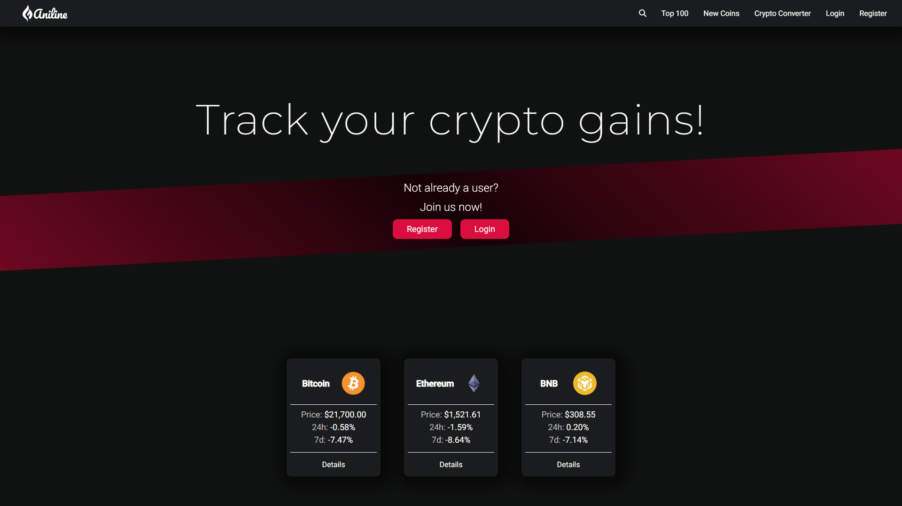

# Aniline
Welcome to **Aniline**, the ultimate platform for crypto enthusiasts and investors. Our website is designed to provide you with real-time information and updates on the latest cryptocurrency prices. With our comprehensive tracking system, you can easily monitor the prices of your favorite cryptocurrencies and stay ahead of the market trends.

In addition to tracking prices, our platform also allows you to manage your portfolio and keep a close eye on its performance. You can add all your crypto holdings and track the value of your portfolio in real-time. Our user-friendly interface makes it easy to view your gains and losses, and analyze your investment strategies.

Whether you're a seasoned investor or just getting started in the world of cryptocurrencies, our website has everything you need to make informed decisions. Stay ahead of the game and join our community today!

You can check it out here 👀 [Aniline](https://aniline.vercel.app/home) 
**The first loading may take from 30-40 seconds because the backend spins down!**

## Tech Stack
- Angular
- NgRx
- NodeJS
- Express
- MongoDB

## Features
- Search
- Top 100 coins
- New Coins
- Detailed information for every coin
- Crypto converter
- Portfolio tracker
- Add assets to your portfolio
- Edit already existing assets
- Delete assets

## You can register yourself or use these credentials
- E-mail - admin@aniline.com
- Password - Admin1234

| E-mail | Password |
| ----------- | ----------- |
| admin@aniline.com | Admin1234 |
